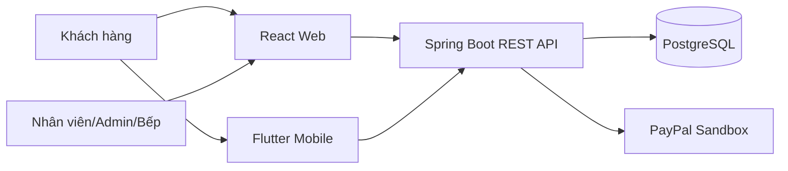
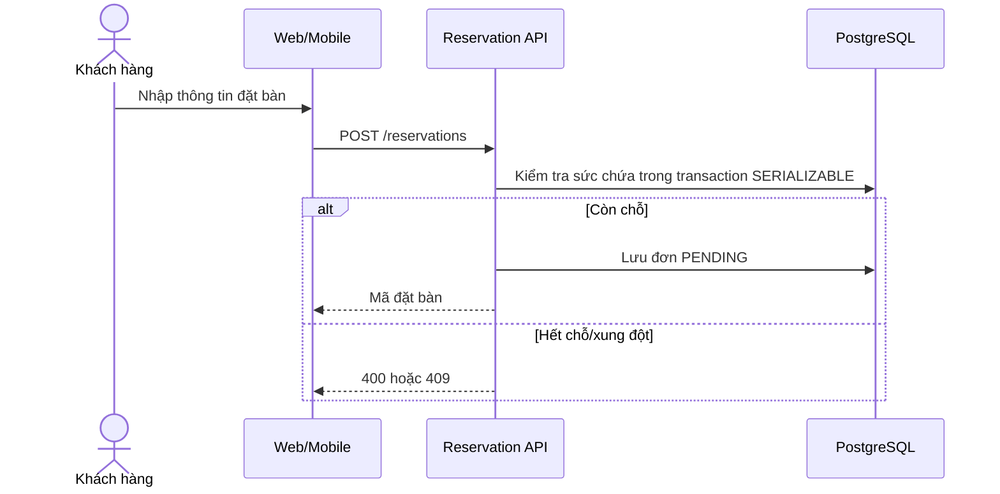

# Kiến trúc hệ thống

## Thành phần

- React cung cấp website khách hàng và dashboard vận hành.
- Flutter sử dụng chung REST API cho thực đơn, đặt bàn và tra cứu.
- Spring Boot thực thi validation, JWT/RBAC và các quy tắc nghiệp vụ.
- PostgreSQL lưu dữ liệu; Flyway quản lý phiên bản schema.

## Luồng đặt bàn

## Trạng thái chính

- Đặt bàn: `PENDING → CONFIRMED → CHECKED_IN → COMPLETED`.
- Nhánh kết thúc sớm: `CANCELLED`, `REJECTED`, `NO_SHOW`.
- Phiếu bếp: `SUBMITTED → PREPARING → READY → SERVED` hoặc `CANCELLED`.
- Bàn: `AVAILABLE → RESERVED → OCCUPIED → NEEDS_CLEANING → AVAILABLE`.

## An toàn dữ liệu

- Tạo đơn chạy ở isolation `SERIALIZABLE` để tránh overbooking đồng thời.
- Reservation và RestaurantTable dùng optimistic version để phát hiện cập nhật chồng chéo.
- Unique constraint bảo vệ mã đơn, email, hóa đơn và mã giao dịch PayPal.
- Xung đột đồng thời/integrity được trả về HTTP 409.
