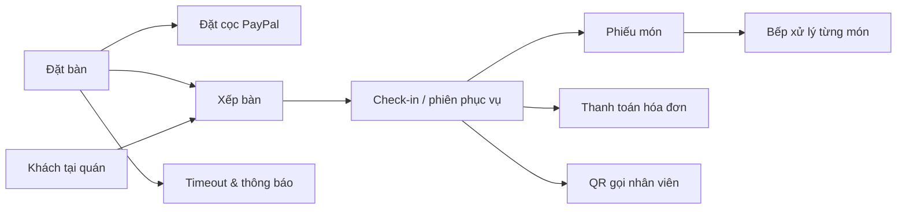

# Sơ đồ cơ sở dữ liệu

Sơ đồ này phản ánh schema hiện tại sau migration `V23`. Hệ thống có 20 bảng, chia thành các nhóm: tài khoản/ca làm, đặt bàn, vận hành tại bàn, bếp, thanh toán, khách tại quán và cảnh báo timeout. Luồng tác nhân và nghiệp vụ sử dụng các bảng này được mô tả tại [`USE_CASE_DIAGRAM.md`](USE_CASE_DIAGRAM.md).

```mermaid
erDiagram
    APP_USERS {
        bigint id PK
        varchar full_name
        varchar email UK
        varchar phone
        varchar password_hash
        varchar role
        boolean active
        timestamptz created_at
    }

    STAFF_SHIFTS {
        bigint id PK
        bigint staff_id FK
        varchar staff_name
        varchar staff_email
        timestamptz starts_at
        timestamptz ends_at
        varchar status
        timestamptz actual_started_at
        timestamptz actual_ended_at
        varchar created_by
    }

    MENU_ITEMS {
        bigint id PK
        varchar name
        varchar category
        numeric price
        boolean featured
        boolean available
        integer preparation_minutes
    }

    RESERVATIONS {
        bigint id PK
        varchar code UK
        varchar customer_name
        varchar phone
        varchar email
        date reservation_date
        time reservation_time
        integer duration_minutes
        integer party_size
        varchar status
        varchar source
        timestamptz hold_expires_at
        boolean notify_email
        boolean notify_sms
    }

    RESERVATION_ITEMS {
        bigint id PK
        bigint reservation_id FK
        bigint menu_item_id FK
        varchar item_name_snapshot
        numeric unit_price
        integer quantity
        varchar status
    }

    RESERVATION_DEPOSITS {
        bigint id PK
        bigint reservation_id FK,UK
        numeric amount
        varchar status
        varchar method
        timestamptz paid_at
        varchar provider_order_id UK
        varchar provider_capture_id
    }

    RESTAURANT_TABLES {
        bigint id PK
        varchar code UK
        varchar name
        varchar floor
        varchar area
        integer seats
        varchar status
        boolean active
        integer layout_x
        integer layout_y
        varchar shape
        varchar public_token UK
    }

    RESERVATION_TABLE_ASSIGNMENTS {
        bigint id PK
        bigint reservation_id FK
        bigint table_id FK
        timestamptz assigned_at
    }

    SERVICE_SESSIONS {
        bigint id PK
        bigint reservation_id FK,UK
        varchar status
        timestamptz opened_at
        timestamptz closed_at
        bigint assigned_staff_id
        varchar assigned_staff_name
        varchar assigned_staff_email
        varchar assigned_by
    }

    DINING_ORDERS {
        bigint id PK
        bigint service_session_id FK
        varchar status
        varchar source
        varchar note
        timestamptz created_at
        timestamptz updated_at
    }

    DINING_ORDER_ITEMS {
        bigint id PK
        bigint order_id FK
        bigint menu_item_id FK
        varchar item_name_snapshot
        numeric unit_price
        integer quantity
        varchar status
        integer preparation_minutes
        timestamptz estimated_ready_at
        timestamptz delayed_until
        timestamptz ready_at
        timestamptz served_at
    }

    PAYMENTS {
        bigint id PK
        bigint service_session_id FK,UK
        varchar invoice_code UK
        numeric subtotal
        numeric discount_amount
        numeric total_amount
        varchar method
        varchar status
        timestamptz paid_at
        varchar provider_order_id
        varchar provider_capture_id
    }

    TABLE_SERVICE_REQUESTS {
        bigint id PK
        bigint table_id FK
        bigint service_session_id FK
        varchar type
        varchar status
        varchar note
        timestamptz created_at
        timestamptz acknowledged_at
        timestamptz completed_at
    }

    WALK_IN_VISITS {
        bigint id PK
        varchar code UK
        varchar customer_name
        varchar phone
        integer party_size
        varchar priority
        varchar status
        timestamptz arrived_at
        integer quoted_wait_minutes
        timestamptz expected_seat_at
        bigint table_id FK
        bigint reservation_id FK
    }

    WALK_IN_EVENTS {
        bigint id PK
        bigint walk_in_visit_id FK
        varchar from_status
        varchar to_status
        varchar action
        varchar actor
        timestamptz created_at
    }

    OPERATIONAL_NOTIFICATIONS {
        bigint id PK
        bigint reservation_id FK
        varchar type
        varchar channel
        varchar status
        varchar recipient
        varchar title
        varchar dedupe_key UK
        timestamptz created_at
    }

    OPERATIONAL_TIMEOUTS {
        bigint id PK
        varchar type
        varchar severity
        varchar status
        varchar entity_type
        bigint entity_id
        bigint reservation_id FK
        bigint table_id FK
        timestamptz deadline_at
        varchar assigned_to
        varchar acknowledged_by
        varchar dedupe_key UK
    }

    OPERATIONAL_TIMEOUT_EVENTS {
        bigint id PK
        bigint timeout_id FK
        varchar action
        varchar actor
        varchar from_assignee
        varchar to_assignee
        varchar note
        timestamptz created_at
    }

    WAITER_ASSIGNMENT_EVENTS {
        bigint id PK
        bigint service_session_id FK
        bigint reservation_id FK
        varchar action
        bigint from_staff_id
        bigint to_staff_id
        varchar actor
        varchar reason
        timestamptz created_at
    }

    RESERVATION_STATUS_EVENTS {
        bigint id PK
        bigint reservation_id FK
        varchar from_status
        varchar to_status
        varchar actor
        varchar reason
        timestamptz created_at
    }

    APP_USERS ||--o{ STAFF_SHIFTS : "có ca làm"
    RESERVATIONS ||--o{ RESERVATION_ITEMS : "đặt trước món"
    MENU_ITEMS ||--o{ RESERVATION_ITEMS : "được chọn"
    RESERVATIONS ||--o| RESERVATION_DEPOSITS : "có tiền cọc"
    RESERVATIONS ||--o{ RESERVATION_TABLE_ASSIGNMENTS : "được xếp"
    RESTAURANT_TABLES ||--o{ RESERVATION_TABLE_ASSIGNMENTS : "nhận lịch"
    RESERVATIONS ||--o| SERVICE_SESSIONS : "mở phiên phục vụ"
    SERVICE_SESSIONS ||--o{ DINING_ORDERS : "có phiếu món"
    DINING_ORDERS ||--o{ DINING_ORDER_ITEMS : "gồm món"
    MENU_ITEMS ||--o{ DINING_ORDER_ITEMS : "tham chiếu món"
    SERVICE_SESSIONS ||--o| PAYMENTS : "thanh toán hóa đơn"
    RESTAURANT_TABLES ||--o{ TABLE_SERVICE_REQUESTS : "gửi yêu cầu QR"
    SERVICE_SESSIONS o|--o{ TABLE_SERVICE_REQUESTS : "thuộc phiên nếu đã check-in"
    RESTAURANT_TABLES o|--o{ WALK_IN_VISITS : "xếp khách trực tiếp"
    RESERVATIONS o|--o{ WALK_IN_VISITS : "tạo đơn phục vụ"
    WALK_IN_VISITS ||--o{ WALK_IN_EVENTS : "lưu timeline"
    RESERVATIONS o|--o{ OPERATIONAL_NOTIFICATIONS : "phát sinh thông báo"
    RESERVATIONS o|--o{ OPERATIONAL_TIMEOUTS : "phát sinh timeout"
    RESTAURANT_TABLES o|--o{ OPERATIONAL_TIMEOUTS : "timeout tại bàn"
    OPERATIONAL_TIMEOUTS ||--o{ OPERATIONAL_TIMEOUT_EVENTS : "lưu xử lý"
    SERVICE_SESSIONS ||--o{ WAITER_ASSIGNMENT_EVENTS : "lưu phân công"
    RESERVATIONS ||--o{ WAITER_ASSIGNMENT_EVENTS : "thuộc đơn"
    RESERVATIONS ||--o{ RESERVATION_STATUS_EVENTS : "lưu đổi trạng thái"
```

## Luồng dữ liệu chính

## Ghi chú thiết kế

- `reservation_items` và `dining_order_items` lưu snapshot tên/giá món để lịch sử không đổi khi thực đơn được sửa.
- `reservation_deposits` là tiền cọc trước khi đến; `payments` là hóa đơn của phiên phục vụ sau khi check-in.
- `table_service_requests.service_session_id` được phép rỗng để khách quét QR gọi nhân viên trước khi có phiên phục vụ.
- Các trường tên/email nhân viên trong phiên, ca và sự kiện là snapshot phục vụ truy vết lịch sử.
- `operational_timeouts` dùng `entity_type + entity_id` để theo dõi nhiều loại SLA; các khóa `reservation_id` và `table_id` hỗ trợ tra cứu nhanh.

Bản có thể nhập vào dbdiagram.io nằm tại [`database.dbml`](database.dbml).
