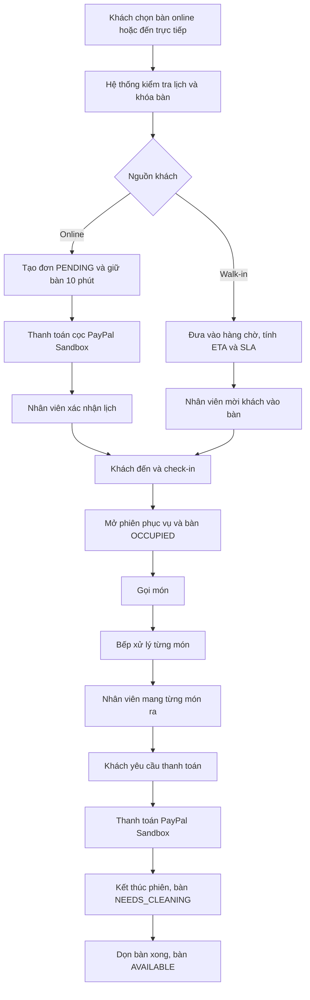
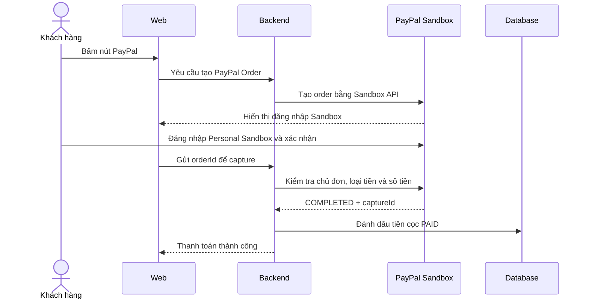
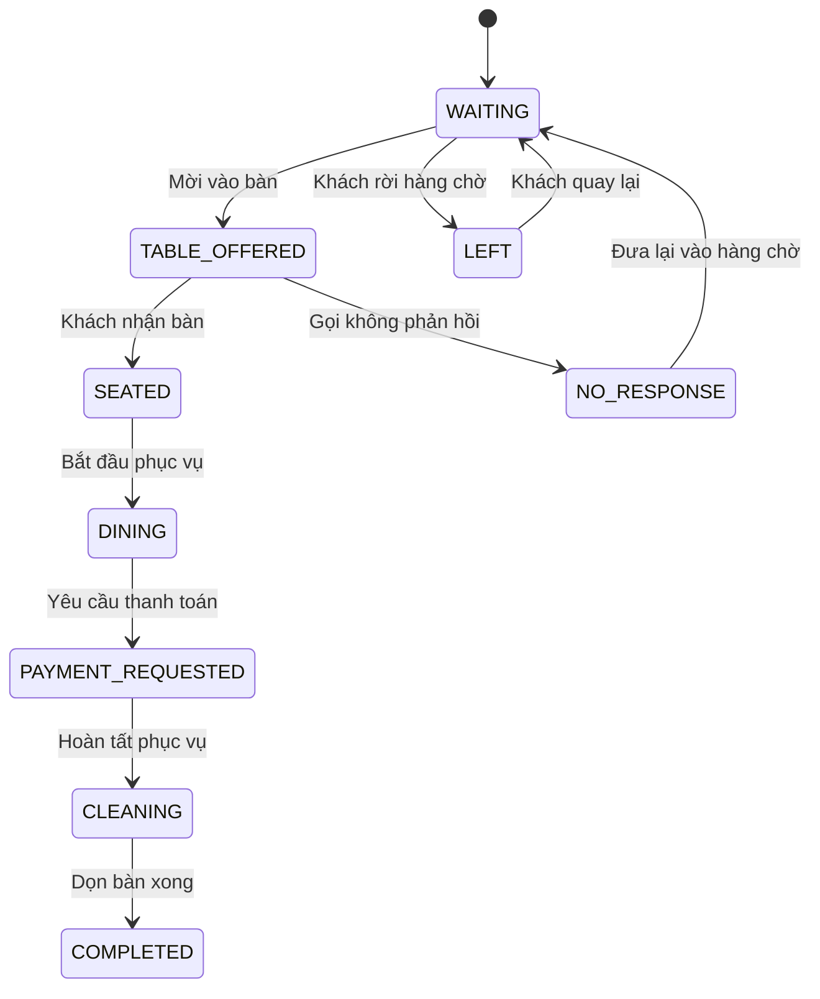
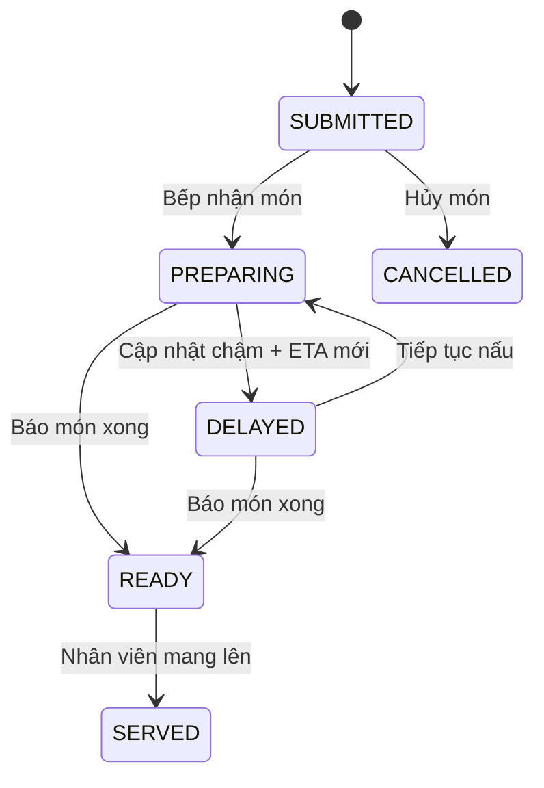

# Luồng nghiệp vụ đồ án Restaurant Reservation System

Tài liệu này mô tả thứ tự vận hành chính xác của hệ thống Khám Phá Việt, dùng để phát triển, kiểm thử và thuyết trình đồ án.

## 1. Phạm vi hệ thống

Hệ thống gồm ba thành phần chạy độc lập:

| Thành phần | Địa chỉ local | Vai trò |
|---|---|---|
| Backend Spring Boot | `http://localhost:8080` | REST API, nghiệp vụ, bảo mật và dữ liệu |
| Web React | `http://localhost:5173` | Khách hàng, Admin, nhân viên, bếp và thu ngân |
| Mobile Flutter | `http://localhost:5174` | Khách đặt bàn; nhân viên và bếp xử lý nghiệp vụ theo quyền |

Các vai trò:

- `CUSTOMER`: xem thực đơn, đặt bàn, thanh toán cọc và tra cứu đơn.
- `STAFF`: xác nhận lịch, xếp bàn, check-in, gọi món, phục vụ và thu ngân.
- `KITCHEN`: nhận từng món, cập nhật ETA, báo chậm và báo món đã xong.
- `ADMIN`: quản lý tài khoản, thực đơn, báo cáo và toàn bộ nghiệp vụ nhân viên.

Không gian demo được gói gọn trong một tầng với tổng 8 bàn: `B07`, `B08` là hai bàn trung tâm; `B01` đến `B06` bố trí bao quanh. Đây là cùng một sơ đồ cho khách chọn bàn, nhân viên phục vụ và màn hình điều phối.

## 2. Luồng tổng thể

## 3. Luồng đặt bàn online

### 3.1. Khách nhập thông tin

Khách thực hiện theo thứ tự:

1. Nhập họ tên.
2. Nhập số điện thoại từ 9 đến 15 ký tự, chỉ gồm số, dấu `+` hoặc khoảng trắng.
3. Nhập email nếu muốn nhận thông báo email.
4. Chọn ngày hiện tại hoặc tương lai.
5. Chọn giờ nhà hàng nhận khách, từ `10:00` đến `21:30`.
6. Chọn thời lượng dùng bàn từ 60 đến 300 phút.
7. Nhập số khách.
8. Chọn một hoặc nhiều bàn có tổng số ghế đủ cho đoàn.
9. Có thể chọn món trước.
10. Gửi yêu cầu đặt bàn.

Hệ thống từ chối khi:

- Ngày hoặc giờ ở quá khứ.
- Giờ nằm ngoài thời gian hoạt động.
- Thời gian dùng bữa kết thúc sau `23:30`.
- Bàn không đủ ghế, đang tạm ngưng hoặc đã bị giữ.
- Lịch mới trùng thời gian dùng bàn cộng thêm 15 phút dọn bàn.
- Hai khách hoặc hai nhân viên chọn cùng một bàn đồng thời.

### 3.2. Tính tiền đặt cọc

- Có chọn món trước: cọc bằng `10% tổng tiền món`.
- Không chọn món trước: cọc `200.000 ₫ × số khách`.

Sau khi tạo đơn:

- Đơn ở trạng thái `PENDING`.
- Bàn được giữ trong 10 phút.
- Hệ thống tạo mã đặt bàn `KV-*`.
- Hệ thống gửi cảnh báo lịch mới cho nhân viên.

### 3.3. Thanh toán cọc

Hệ thống chỉ sử dụng **PayPal Sandbox**:

Quy tắc an toàn:

- Không sử dụng tài khoản PayPal thật.
- Người mua đăng nhập bằng tài khoản `Personal Sandbox`.
- Nhà hàng nhận tiền bằng tài khoản `Business Sandbox`.
- Backend kiểm tra `custom_id`, số tiền, loại tiền và trạng thái `COMPLETED`.
- Capture được xử lý idempotent, gửi lại cùng giao dịch không tạo thanh toán thứ hai.
- `Client Secret` chỉ lưu trong `.env`, không đưa lên Git.

Sau khi nhận cọc:

1. Đơn vẫn ở `PENDING` và timeline của khách hiển thị **Đã đặt cọc · chờ nhà hàng xác nhận**.
2. Nhân viên kiểm tra số tiền, giao dịch PayPal, thời gian, số khách và bàn.
3. Nhân viên bấm xác nhận trong hộp thoại có nội dung rõ ràng.
4. Backend chỉ cho phép `PENDING → CONFIRMED` khi tiền cọc là `PAID`.
5. Hệ thống lưu người xác nhận, thời điểm và lý do vào lịch sử trạng thái.
6. Hệ thống gửi xác nhận cho khách qua email/SMS theo tùy chọn nhận thông báo.
7. Nếu đã cọc nhưng chưa xác nhận sau 5 phút, hệ thống tạo timeout `RESERVATION_CONFIRMATION`; không tự hủy đơn đã thanh toán.

Các thao tác từ chối, hủy và đánh dấu `NO_SHOW` đều phải qua hộp xác nhận và bắt buộc nhập lý do. Check-in và hoàn tất lượt khách cũng có hộp xác nhận để tránh bấm nhầm.

Nếu khách không đặt cọc trong thời gian giữ bàn:

`PENDING → EXPIRED`, sau đó hệ thống tự giải phóng bàn.

## 4. Luồng khách đến nhà hàng

### 4.1. Khách đặt online đến đúng giờ

1. Nhân viên tìm đơn bằng mã hoặc số điện thoại.
2. Kiểm tra đơn đã `CONFIRMED`.
3. Xác nhận khách đến.
4. Hệ thống chuyển:
   - Đơn: `CONFIRMED → CHECKED_IN`.
   - Bàn: `RESERVED → OCCUPIED`.
   - Tạo `ServiceSession` ở trạng thái `ACTIVE`.
5. Khách bắt đầu sử dụng bàn và có thể gọi món.

### 4.2. Khách đến trễ

- Trước giờ 30 phút: hệ thống tạo cảnh báo khách sắp đến.
- Trễ 15 phút: cảnh báo mức `WARNING`.
- Trễ 20 phút: cảnh báo mức `CRITICAL`.
- Hệ thống không tự hủy khách đã xác nhận.
- Nhân viên liên hệ khách và quyết định:
  - Tiếp tục giữ bàn.
  - Đánh dấu `NO_SHOW`.
  - Hủy theo yêu cầu khách.

Quy tắc này tránh lỗ hổng tự động hủy nhầm khách đang trên đường đến.

### 4.3. Phân công nhân viên theo bàn

Khi khách đã check-in, hệ thống mở một `service session`. Mỗi phiên phục vụ chỉ có một nhân viên phụ trách chính nhưng một nhân viên có thể phụ trách nhiều bàn.

1. Admin lên ca và bấm bắt đầu ca cho nhân viên.
2. Chỉ nhân viên có ca `ACTIVE`, nằm trong khoảng giờ làm việc mới xuất hiện trong danh sách phân công.
3. Nếu chưa có người phụ trách, bàn hiển thị màu cảnh báo và nhãn `Chưa phân công`.
4. Admin chọn nhân viên từ bảng `Phân công bàn` ở góc phải màn hình.
5. Nhân viên phục vụ có thể bấm `Nhận bàn` nếu đang trong ca và bàn chưa được phân công.
6. Nhân viên không được lấy bàn đang thuộc người khác; chỉ Admin được điều phối lại.
7. Khi chuyển hoặc bỏ người phụ trách, Admin phải nhập lý do bàn giao.
8. Hệ thống lưu người cũ, người mới, người thao tác, lý do và thời điểm để truy vết.
9. Tên nhân viên được hiển thị trực tiếp trên sơ đồ bàn, trang phục vụ món và bảng tải công việc.
10. Khi một lượt khách dùng nhiều bàn, toàn bộ các bàn đó dùng chung một người phụ trách theo `service session`.
11. Phân công tự kết thúc cùng phiên phục vụ, không gắn vĩnh viễn vào bàn vật lý.

Tải công việc được tính từ số phiên phục vụ, số bàn và tổng số khách:

- `NORMAL`: tối đa 3 bàn và tối đa 16 khách.
- `BUSY`: trên 3 bàn hoặc trên 16 khách.
- `OVERLOADED`: trên 5 bàn hoặc trên 28 khách.
- Hệ thống đánh dấu nhân viên có điểm tải thấp nhất là người được đề xuất nhận bàn tiếp theo.

Nhân viên phục vụ có hai chế độ xem:

- `Bàn của tôi`: mặc định, chỉ hiện bàn và yêu cầu QR thuộc trách nhiệm của mình.
- `Tất cả bàn`: dùng khi cần hỗ trợ đồng nghiệp hoặc nhận bàn chưa phân công.

Thanh điều hướng nội bộ nằm bên cạnh màn hình và chỉ hiện chức năng phù hợp với quyền:

- `ADMIN`: toàn bộ quản trị, đặt bàn, walk-in, phục vụ, sơ đồ bàn, món, bếp và thanh toán.
- `STAFF`: đặt bàn, walk-in, phục vụ, sơ đồ bàn, món và thanh toán.
- `KITCHEN`: chỉ điều phối bếp.
- Trang nội bộ không hiển thị footer công khai để dành không gian cho nghiệp vụ.

## 5. Luồng khách Walk-in

Walk-in là khách đến trực tiếp, không đặt trước trên web.

Thứ tự nghiệp vụ:

1. Lễ tân nhập tên, số khách, khu vực mong muốn và mức ưu tiên.
2. Hệ thống tính ETA và đề xuất bàn phù hợp.
3. Đề xuất ưu tiên:
   - Đủ ghế.
   - Ít ghế thừa.
   - Đúng khu vực mong muốn.
   - Không ảnh hưởng lịch online sắp tới.
4. Nhân viên chọn bàn và mời khách.
5. Bàn được khóa để nhân viên khác không xếp trùng.
6. Khi khách ngồi, hệ thống tạo đơn nền và phiên phục vụ chung với khách online.
7. Toàn bộ gọi món, bếp, phục vụ và thanh toán dùng chung một luồng.

Mức SLA:

- `NORMAL`: còn trong thời gian dự kiến.
- `WARNING`: sắp hết thời gian chờ hoặc thời gian phản hồi.
- `CRITICAL`: đã quá thời gian cam kết.

Trong profile demo, nút **Tạo tình huống demo** mở một xưởng tình huống cho toàn hệ thống. Có 5 nhóm và 23 lựa chọn: khách tại quán; lịch đặt mới/sắp đến/trễ/hết hạn cọc; món mới/đang nấu/bếp báo chậm/tự động quá ETA/món xong; QR gọi nhân viên/nước/thanh toán/chưa tiếp nhận; bàn chờ dọn/dọn chậm. Người trình bày tự chọn dữ liệu và mỗi lần xác nhận chỉ tạo đúng một tình huống.

## 6. Luồng gọi món và bếp

### 6.1. Nhân viên tạo phiếu món

1. Chọn bàn đang có phiên phục vụ.
2. Chọn từng món và số lượng.
3. Gửi phiếu xuống bếp.
4. Mỗi món có ETA dựa trên `preparationMinutes`.

### 6.2. Bếp xử lý từng món

Quy tắc:

- Trạng thái được cập nhật theo từng món, không cập nhật chung mơ hồ cho cả phiếu.
- Khi báo chậm, bếp phải nhập lý do và thời gian dự kiến mới.
- Khi bếp bấm `READY`, thông báo realtime ghi rõ tên món và bàn.
- Nhân viên chỉ bấm `SERVED` sau khi thực sự mang món lên.
- Trước ETA 3 phút, hệ thống tự cảnh báo bếp kiểm tra tiến độ.
- Món vừa quá ETA tự tạo timeout `KITCHEN_SLA`; không cần bếp bấm báo chậm trước.
- Sau 5 phút, cảnh báo ghi rõ bàn và nhân viên phụ trách để chủ động báo khách.
- Sau 10 phút, timeout chuyển `CRITICAL` để quản lý điều phối.
- Khi bếp cập nhật ETA mới hoặc báo món xong, timeout đang mở tự đóng. Lịch sử cảnh báo vẫn được giữ để kiểm tra.

## 7. QR tại bàn

QR tại bàn **không phải QR thanh toán**.

Khách quét QR được đặt trên bàn để:

- Gọi nhân viên.
- Xin thêm nước.
- Xin dụng cụ.
- Yêu cầu thanh toán.

Luồng yêu cầu:

`NEW → ACKNOWLEDGED → DONE`

Quy tắc:

- QR chỉ hoạt động khi bàn có phiên phục vụ đang mở.
- Có giới hạn chống gửi yêu cầu liên tục.
- Yêu cầu quá thời gian nhận việc sẽ tạo timeout.
- Nhân viên phải bấm nhận việc trước khi hoàn tất.

## 8. Luồng thanh toán hóa đơn

Thanh toán hóa đơn cuối bữa chỉ sử dụng **PayPal Sandbox**:

1. Tất cả món phải ở trạng thái `SERVED` hoặc `CANCELLED`.
2. Nhân viên mở màn hình thu ngân.
3. Kiểm tra các dòng món và tổng tiền.
4. Nhập giảm giá nếu có; giảm giá không được lớn hơn tạm tính.
5. Khách đăng nhập tài khoản Personal Sandbox.
6. Backend tạo order và capture qua Sandbox API.
7. Backend kiểm tra số tiền và mã phiên phục vụ.
8. Hệ thống tạo hóa đơn `HD-*` và lưu `providerOrderId`, `providerCaptureId`.
9. Gửi lại cùng order không tạo thanh toán trùng.
10. Nhân viên kết thúc lượt khách và chuyển bàn sang chờ dọn.

Không còn luồng chuyển khoản hoặc QR ngân hàng.

## 9. Luồng kết thúc và dọn bàn

1. Phiên phục vụ được hoàn tất.
2. Đơn chuyển `CHECKED_IN → COMPLETED`.
3. Bàn chuyển `OCCUPIED → NEEDS_CLEANING`.
4. Hệ thống bắt đầu tính thời gian dọn bàn.
5. Nếu quá mục tiêu 15 phút, hệ thống tạo timeout.
6. Nhân viên xác nhận dọn xong.
7. Bàn chuyển `NEEDS_CLEANING → AVAILABLE`.
8. Bàn được phép nhận lượt khách mới.

## 10. Trung tâm timeout

Các loại timeout:

| Loại | Đối tượng | Cách xử lý |
|---|---|---|
| `RESERVATION_HOLD` | Đơn chưa đặt cọc | Tự hết hạn và giải phóng bàn |
| `RESERVATION_CONFIRMATION` | Đơn đã cọc chờ nhân viên xác nhận | Kiểm tra giao dịch và xác nhận trong 5 phút |
| `CUSTOMER_LATE` | Khách online trễ | Nhân viên liên hệ và quyết định |
| `KITCHEN_SLA` | Món quá ETA | Bếp cập nhật ETA hoặc báo món xong |
| `SERVICE_REQUEST_ACK` | QR tại bàn chưa được nhận | Nhân viên nhận yêu cầu |
| `TABLE_CLEANING` | Bàn dọn quá lâu | Điều phối nhân viên dọn bàn |

Vòng đời xử lý:

1. Hệ thống mở timeout `OPEN`.
2. Một nhân viên nhận việc.
3. Người nhận xác nhận đang xử lý.
4. Quản lý có thể chuyển người phụ trách.
5. Nhân viên hoàn tất và ghi chú kết quả.
6. Timeout chuyển `RESOLVED`.
7. Nhật ký lưu người giao, người nhận, người xác nhận và người hoàn tất.

Các màn hình vận hành nhận cảnh báo bằng SSE realtime. Polling định kỳ vẫn được giữ làm cơ chế dự phòng.

## 11. Thông báo

### Nhân viên

- Có lịch đặt mới.
- Đã nhận tiền cọc.
- Đơn đã cọc quá 5 phút nhưng chưa được xác nhận.
- Đã xác nhận đơn và lưu lịch sử người thao tác.
- Khách sắp đến.
- Khách trễ.
- Walk-in mới hoặc quá SLA.
- Khách gọi từ QR tại bàn.
- Món chậm hoặc món đã sẵn sàng.
- Timeout cần xử lý.

### Khách hàng

- Email qua Gmail khi bật cấu hình SMTP.
- SMS đang ở chế độ Sandbox, chỉ lưu và ghi log, không phát sinh phí.
- Timeline trên web/mobile phân biệt rõ “đã gửi yêu cầu”, “đã cọc” và “nhà hàng đã xác nhận”.

## 12. Kịch bản trình bày đồ án

### Kịch bản A — Đặt bàn online

1. Mở `http://localhost:5173/dat-ban`.
2. Chọn ngày tương lai, giờ và bàn đủ ghế.
3. Chọn một vài món để chứng minh cọc bằng 10%.
4. Gửi đơn và ghi lại mã `KV-*`.
5. Thanh toán bằng tài khoản Personal Sandbox.
6. Chỉ ra timeline đang ở bước **Đã đặt cọc · chờ xác nhận**.
7. Đăng nhập nhân viên, mở hộp xác nhận đơn và xác nhận.
8. Mở lịch sử để chỉ ra người thao tác, thời điểm và lý do.
9. Check-in qua hộp xác nhận.
10. Chỉ ra bàn đổi màu từ đặt trước sang đang phục vụ.

### Kịch bản B — Bếp và phục vụ

1. Tạo phiếu có ít nhất hai món.
2. Bếp nhận món thứ nhất và báo món thứ hai chậm.
3. Bếp báo món thứ nhất đã xong.
4. Màn hình phục vụ nhận thông báo realtime.
5. Nhân viên xác nhận đã mang riêng món thứ nhất.
6. Cập nhật món thứ hai hoàn tất và phục vụ.
7. Với một món gần/quá ETA, chỉ ra bộ lọc **Cần chú ý**, số phút chậm và ba mức chuyển tiếp 3/5/10 phút.

### Kịch bản C — QR tại bàn

1. Mở QR của bàn đang có khách.
2. Gửi yêu cầu gọi nhân viên.
3. Màn hình sơ đồ bàn hiển thị cảnh báo.
4. Nhân viên nhận việc rồi đánh dấu hoàn tất.
5. Giải thích đây là QR phục vụ, không phải QR thanh toán.

### Kịch bản D — Walk-in và timeout

1. Mở `/staff/walk-in`.
2. Bấm **Tạo tình huống demo**.
3. Chọn nhóm nghiệp vụ và tình huống cần trình bày; nhập khách, bàn, món, số phút và lý do phù hợp rồi xác nhận.
4. Với ví dụ món chậm, chọn **Bếp & món ăn → Món tự động quá ETA**, sau đó mở `/bep` để xem món và trung tâm timeout để xem cảnh báo tự động.
5. Với ví dụ khách tại quán, mở thẻ vừa tạo để giải thích SLA, chọn bàn từ đề xuất an toàn, mời khách và xác nhận khách ngồi.
6. Với ví dụ QR hoặc dọn bàn, mở màn hình phục vụ/bàn để tiếp nhận và hoàn tất tình huống.
7. Mở trung tâm timeout, nhận việc, chuyển việc và hoàn tất một cảnh báo.

### Kịch bản E — Thanh toán cuối bữa

1. Đảm bảo tất cả món đã được phục vụ.
2. Mở màn hình thu ngân.
3. Kiểm tra tổng hóa đơn.
4. Thanh toán bằng PayPal Sandbox.
5. Kết thúc lượt khách.
6. Xác nhận bàn chờ dọn rồi chuyển về sẵn sàng.

## 13. Checklist trước khi demo

- [ ] Backend `http://localhost:8080/actuator/health` trả `UP`.
- [ ] Web `http://localhost:5173` mở được.
- [ ] Mobile `http://localhost:5174` mở được.
- [ ] PayPal config trả `enabled: true`.
- [ ] Có tài khoản Personal Sandbox để đăng nhập thanh toán.
- [ ] Không hiển thị hoặc chia sẻ `.env`.
- [ ] Ngày đặt thử là ngày hiện tại hoặc tương lai.
- [ ] Bàn được chọn có đủ ghế.
- [ ] Dùng profile demo để có dữ liệu sạch.
- [ ] Thử realtime giữa hai tab nhân viên và bếp.
- [ ] Không gọi PayPal Live và không dùng tài khoản thật.

## 14. Các điểm bảo vệ trước câu hỏi phản biện

- **Chống trùng bàn:** transaction mức `SERIALIZABLE`, khóa bi quan theo ID bàn và kiểm tra xung đột lại ở backend.
- **Chống thanh toán hai lần:** unique constraint, khóa phiên phục vụ và idempotency theo PayPal order.
- **Không tự hủy khách trễ:** chỉ cảnh báo; nhân viên chịu trách nhiệm quyết định.
- **Không xác nhận đơn chưa cọc:** backend kiểm tra trạng thái `PAID`, không chỉ ẩn nút ở giao diện.
- **Không bỏ quên đơn đã cọc:** SLA xác nhận 5 phút, cảnh báo realtime và tự đóng khi nhân viên xử lý.
- **Chống thao tác nhầm:** hộp xác nhận trước hành động quan trọng; hủy/từ chối/no-show bắt buộc lý do và có audit trail.
- **Không che giấu món chậm:** hệ thống tự so ETA mỗi phút, cảnh báo 3/5/10 phút; trạng thái, bộ đếm và ETA nằm trên từng món ở cả web/mobile.
- **Không bỏ sót trách nhiệm:** timeout có assignee, acknowledge, resolvedBy và audit event.
- **Không chiếm lịch online bởi walk-in:** bàn đề xuất kiểm tra lịch online tiếp theo và thời gian dọn bàn.
- **Mất kết nối realtime:** polling định kỳ tiếp tục đồng bộ.
- **Bảo mật thanh toán:** Secret nằm ở backend `.env`; frontend chỉ nhận Client ID công khai.
