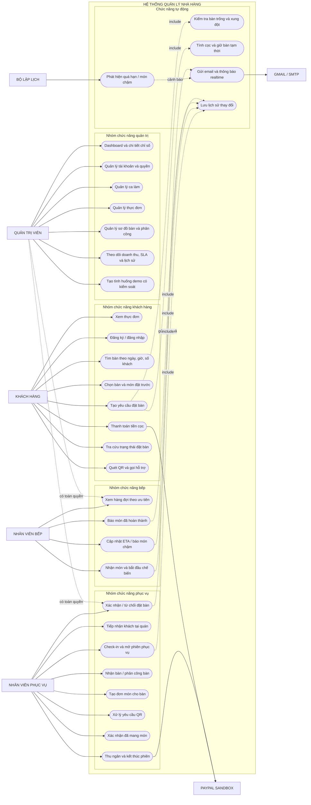
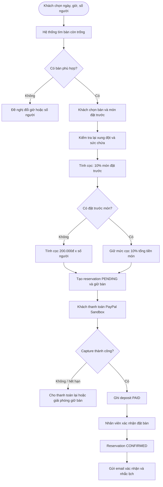
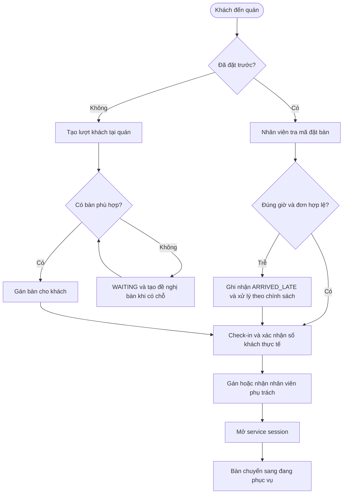
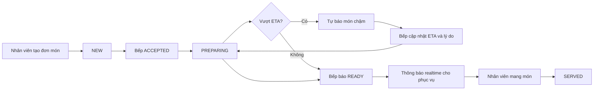
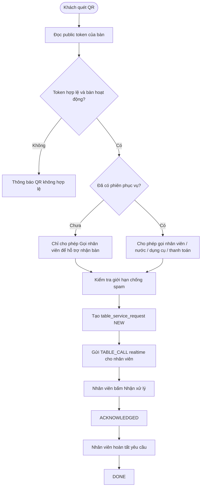
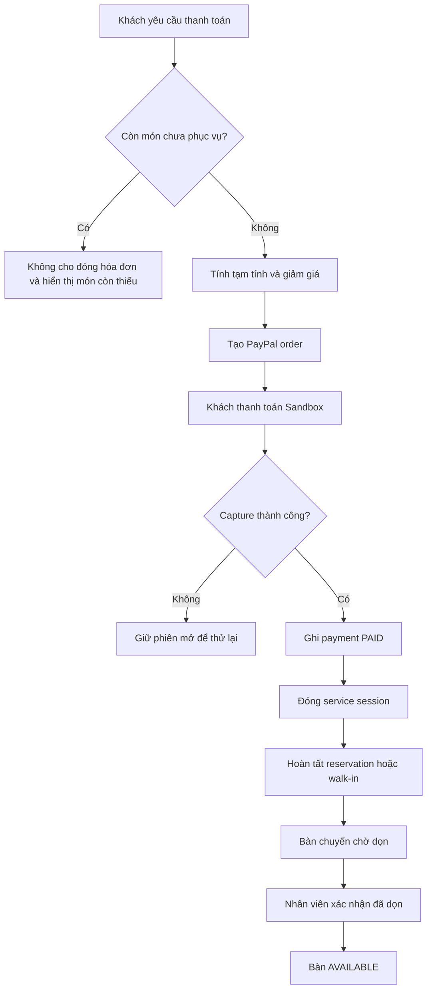
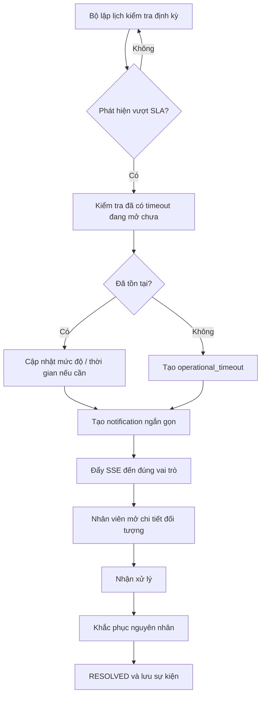
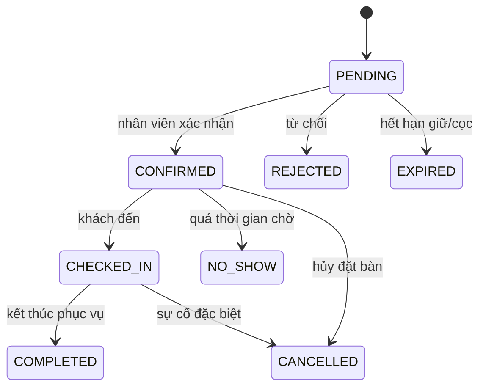
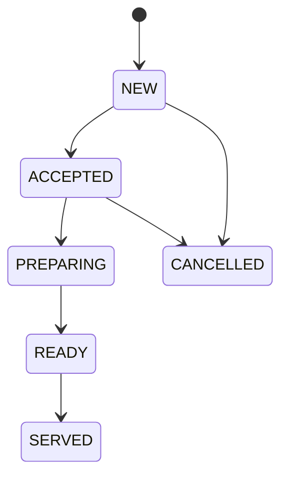
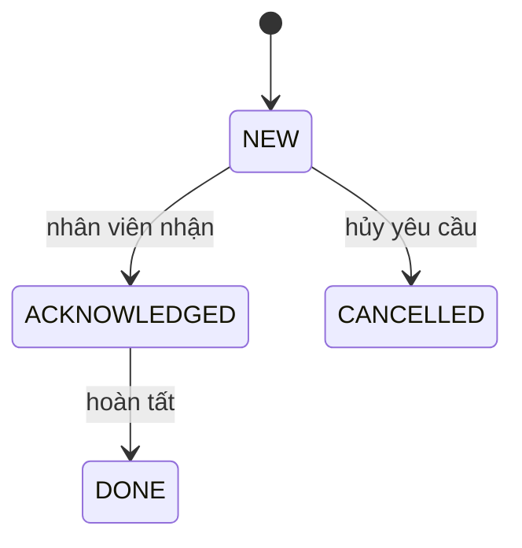

# Use case và luồng nghiệp vụ hệ thống

Tài liệu này mô tả các tác nhân, quyền sử dụng và luồng chính của hệ thống quản lý nhà hàng. Sơ đồ cơ sở dữ liệu tương ứng nằm tại [`DATABASE_DIAGRAM.md`](DATABASE_DIAGRAM.md).

## 1. Tác nhân và phạm vi quyền

| Tác nhân | Trách nhiệm chính |
|---|---|
| Khách hàng | Xem thực đơn, đặt bàn online, chọn bàn, đặt trước món, thanh toán cọc PayPal, tra cứu đơn và quét QR tại bàn |
| Nhân viên phục vụ | Xác nhận khách, tiếp nhận khách tại quán, nhận bàn, tạo đơn món, xử lý yêu cầu QR, phục vụ món và thanh toán cuối bữa |
| Nhân viên bếp | Xem hàng đợi món, nhận chế biến, cập nhật thời gian dự kiến, báo món chậm và báo món hoàn thành |
| Quản trị viên | Xem toàn bộ dashboard; quản lý tài khoản, ca làm, thực đơn, bàn, đặt bàn, vận hành, thanh toán và báo cáo |
| PayPal Sandbox | Xử lý giao dịch cọc và hóa đơn thử nghiệm |
| Gmail/SMTP | Gửi xác nhận đặt bàn và các thông báo cho khách |
| Bộ lập lịch hệ thống | Kiểm tra SLA, sinh cảnh báo món chậm, khách sắp đến, khách trễ và yêu cầu phục vụ quá hạn |

## 2. Sơ đồ use case tổng thể

## 3. Danh mục use case chi tiết

### 3.1. Khách hàng

| Mã | Use case | Dữ liệu vào | Xử lý chính | Kết quả |
|---|---|---|---|---|
| UC-C01 | Xem thực đơn | Danh mục hoặc từ khóa | Lọc các món đang bán | Danh sách món, giá và thời gian dự kiến |
| UC-C02 | Tìm và chọn bàn | Ngày, giờ, số khách | Loại bàn xung đột, kiểm tra sức chứa | Danh sách bàn phù hợp trên sơ đồ màu |
| UC-C03 | Đặt bàn online | Thông tin khách, thời gian, bàn, món | Tạo mã đặt bàn, giữ bàn, tính tiền cọc | Đơn ở trạng thái `PENDING` chờ cọc/xác nhận |
| UC-C04 | Thanh toán cọc | Mã đặt bàn, PayPal order | Backend xác thực đúng đơn, đúng số tiền và capture | Cọc `PAID`, đặt bàn tiếp tục chờ xác nhận |
| UC-C05 | Tra cứu đặt bàn | Mã đặt bàn hoặc tài khoản | Kiểm tra quyền và tải lịch sử trạng thái | Chi tiết bàn, món, cọc và trạng thái |
| UC-C06 | Gọi hỗ trợ bằng QR | Token QR, loại yêu cầu | Kiểm tra QR, chống gửi liên tục, tạo yêu cầu | Nhân viên nhận cảnh báo realtime |

### 3.2. Nhân viên phục vụ

| Mã | Use case | Điều kiện | Xử lý chính | Kết quả |
|---|---|---|---|---|
| UC-S01 | Duyệt đặt bàn | Đơn hợp lệ | Xác nhận, từ chối hoặc hủy kèm lý do | Cập nhật trạng thái và gửi email khách |
| UC-S02 | Tiếp nhận khách tại quán | Có bàn phù hợp hoặc danh sách chờ | Ghi nhận khách, tạo đề xuất/giữ chỗ | Khách được xếp bàn hoặc chờ bàn |
| UC-S03 | Check-in | Đơn đã xác nhận hoặc walk-in được xếp bàn | Gán bàn, nhân viên, số khách; mở phiên | `service_sessions` ở trạng thái `OPEN` |
| UC-S04 | Nhận bàn | Nhân viên đang trong ca | Claim bàn hoặc admin phân công | Bàn hiển thị đúng người phụ trách |
| UC-S05 | Tạo đơn món | Phiên phục vụ đang mở | Chọn món, số lượng, ghi chú | Đơn chuyển vào hàng đợi bếp |
| UC-S06 | Xử lý yêu cầu QR | Yêu cầu ở trạng thái `NEW` | Nhận xử lý rồi hoàn tất | `NEW → ACKNOWLEDGED → DONE` |
| UC-S07 | Phục vụ món | Bếp đã báo `READY` | Xác nhận món đã mang lên | Món chuyển sang `SERVED` |
| UC-S08 | Thanh toán cuối bữa | Mọi món đã `SERVED`/`CANCELLED` | Tính tiền, PayPal capture, đóng phiên | Hóa đơn `PAID`, bàn chờ dọn/trống |

### 3.3. Nhân viên bếp

| Mã | Use case | Xử lý chính | Kết quả |
|---|---|---|---|
| UC-K01 | Xem hàng đợi | Ưu tiên món đặt trước, món gần/quá hạn và thời điểm tạo | Danh sách cần làm trước hiển thị rõ màu |
| UC-K02 | Nhận chế biến | Nhận món `NEW` và bắt đầu làm | `NEW → ACCEPTED → PREPARING` |
| UC-K03 | Điều chỉnh ETA | Nhập thời gian dự kiến mới và lý do chậm | Nhân viên phục vụ nhận cảnh báo cập nhật |
| UC-K04 | Hoàn thành món | Bếp xác nhận chế biến xong | `PREPARING → READY`, nhân viên được báo mang món |

### 3.4. Quản trị viên

Quản trị viên được dùng toàn bộ chức năng của nhân viên phục vụ và nhân viên bếp, đồng thời có các use case riêng:

- Xem từng thẻ chỉ số dashboard và danh sách bản ghi tạo nên chỉ số đó.
- Quản lý tài khoản, vai trò, trạng thái hoạt động và ca làm.
- Quản lý thực đơn, giá, trạng thái bán và thời gian chế biến chuẩn.
- Quản lý tám bàn, sơ đồ màu, QR, lịch giữ bàn và nhân viên phụ trách.
- Theo dõi đặt bàn, khách tại quán, doanh thu, thanh toán, món chậm và SLA.
- Tạo tình huống demo bằng biểu mẫu có dữ liệu, trạng thái và thời gian do người dùng chọn.

## 4. Luồng nghiệp vụ chính

### 4.1. Đặt bàn online và thanh toán cọc

Ngoại lệ quan trọng:

- Bàn vừa bị người khác giữ: yêu cầu khách chọn lại bàn.
- PayPal order không thuộc đơn hoặc sai số tiền: từ chối capture.
- Hết thời gian giữ bàn mà chưa thanh toán: đơn chuyển `EXPIRED` và bàn được giải phóng.

### 4.2. Khách đến quán và mở phiên phục vụ

### 4.3. Gọi món, bếp chế biến và phục vụ

Thứ tự hàng đợi ưu tiên: món đã chậm → món gần đến hạn → món đặt trước theo giờ khách đến → món tạo trước.

### 4.4. Khách quét QR tại bàn

Khách quét QR không phải đăng nhập. QR xác định bàn bằng token công khai; phiên đăng nhập chỉ bắt buộc ở màn hình nghiệp vụ của nhân viên.

### 4.5. Thanh toán và kết thúc bàn

### 4.6. Cảnh báo timeout và realtime

Các nhóm timeout chính: đặt bàn mới chưa xác nhận, khách sắp đến, khách trễ 15–20 phút, món vượt ETA, món `READY` chưa mang, yêu cầu QR chưa nhận và bàn chưa dọn.

## 5. Vòng đời trạng thái quan trọng

### Đặt bàn

### Món trong đơn phục vụ

### Yêu cầu QR

## 6. Liên kết use case với cơ sở dữ liệu

| Nhóm nghiệp vụ | Bảng chính |
|---|---|
| Tài khoản và phân quyền | `app_users`, `staff_shifts` |
| Đặt bàn online | `reservations`, `reservation_items`, `reservation_deposits`, `reservation_table_assignments`, `reservation_status_events` |
| Sơ đồ bàn và phiên phục vụ | `restaurant_tables`, `service_sessions`, `waiter_assignment_events` |
| Gọi món và bếp | `menu_items`, `dining_orders`, `dining_order_items` |
| QR gọi nhân viên | `table_service_requests` |
| Khách tại quán | `walk_in_visits`, `walk_in_events` |
| Thanh toán cuối bữa | `payments` |
| Cảnh báo, SLA và realtime | `operational_notifications`, `operational_timeouts`, `operational_timeout_events` |

## 7. Cách trình bày ngắn khi bảo vệ

> Hệ thống quản lý trọn vòng đời một lượt ăn: khách tìm và đặt bàn, thanh toán cọc, nhà hàng xác nhận và check-in, nhân viên nhận bàn, bếp xử lý món theo ETA, phục vụ mang món, khách yêu cầu hỗ trợ qua QR và thanh toán cuối bữa. Mọi bước quan trọng đều có trạng thái, lịch sử và cảnh báo quá hạn. Admin có quyền giám sát toàn bộ, còn nhân viên phục vụ và bếp chỉ thấy đúng dashboard nghiệp vụ của mình.

ERD đầy đủ: [`DATABASE_DIAGRAM.md`](DATABASE_DIAGRAM.md). Bản DBML để nhập vào dbdiagram.io: [`database.dbml`](database.dbml).
